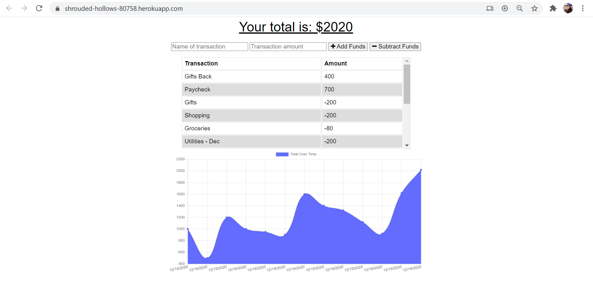
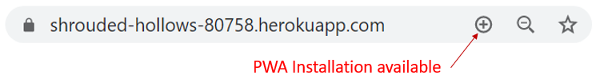

# Budget Tracker

## Table of Contents
* [Description](#description)
* [Installation](#installation)
* [Usage](#usage)
* [Contributing](#contributing)
* [Tests](#tests)
* [License](#license)
* [Questions](#questions)

## Description <a name="description"></a>
This is a Budget Tracker application that allows the user to track their budget through adding and subtracting funds.  The starter code was provided for online functionality of the Budget Tracker.  The application uses Express.js for the server, Mongoose for the Object-Document Mapper, and MondoDB for the database.  The application also uses the Compression and Morgan technologies, which we have not discussed directly in class.  (Compression is a middleware that decreases the amount of data that's served to users to improve application performance.  Morgan is a middleware that simplifies the process of logging request to the application.)  The intent of this exercise was to update/revise the starter code to create offline functionality and to make the application a Progressive Web Application (PWA).  IndexedDb is used for the offline database, service workers are used to store all of the front-end assets, and a web mainfest is added to provide a user's device with metadata for the progressive web application. 

## Installation <a name="installation"></a>
To run the code of the application, please do the following: 

1. Clone the application's respository from GitHub onto your local drive.  The GitHub URL is: https://github.com/plainjane99/Budget_Tracker.

2. Set up the ```npm``` package by running the following command in the root directory of the application: 
    
    ```
    npm install
    ```
    
    This will download the application's dependencies into your root directory.  You should now have a folder called ```node_modules``` and a file called ```package-lock.json```.  The ```package-lock.json``` file should include ```express```, ```mongoose```, ```compression```, and ```morgan```.
3. A ```.gitignore``` file should be created to include:
    ```
    node_modules
    .env
    .DS_Store
    ```
    if you intend to push your code to a repository.

## Usage <a name="usage"></a>

1. a.  Once code installation is complete, run the application by typing the following into the command line at the root directory of the application:

    ```
    npm start
    ```
    
The application will start and indicate the server is running.  Once the server is running, go to localhost:3001 to test out the application.  

1. b. The live version of the application is located at:  https://shrouded-hollows-80758.herokuapp.com/

2. Whether on the local server or the live application, you should see the following:



Functionality includes adding and subtracting funds that will be added to the transaction table and will update the graph.  

a. Offline functionality through the local server can be simulated by using Chrome Dev Tools by going to the ```Network``` tab and changing the ```Throttling``` pull-down to ```Offline```.  The application should still function when transactions are input.  Once the ```Throttling``` pull-down is set back to ```Online```, all transactions stored via IndexedDb will be pushed to the online database.

b. Offline functionality through the live application can be simulated by placing your mobile device or desktop/laptop to ```airplane mode``` or disconnecting from the internet.  The application should still function when transactions are input.  Once your internet connection is re-established, all transactions stored via IndexedDb will be pushed to the online database.

3. The application can be installed as a PWA by clicking the circled plus sign in the URL as shown below:


## Contributing <a name="contributing"></a>
Contributions are welcome.  Please contact me regarding improvements, questions, or comments you would like to make.

## Tests <a name="tests"></a>
This application uses Chrome Dev Tools as a testing method for all offline functionality.

## License <a name="license"></a>
This application is covered under the ISC license.

## Questions <a name="questions"></a>
My GitHub username is ```plainjane99```.  Please feel free to peruse my other projects.

If you have any questions regarding this application, please contact me via email at ```jane99hsu@gmail.com```.
  